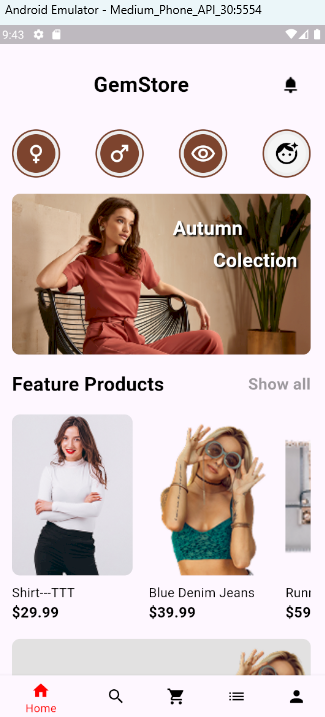
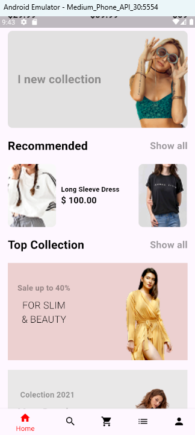
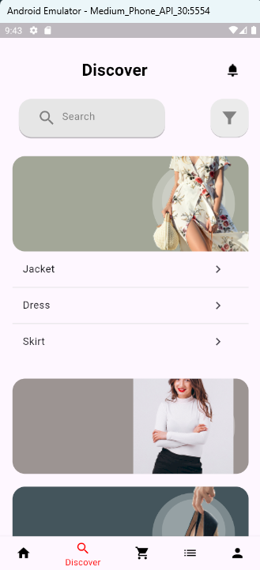
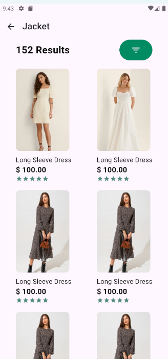
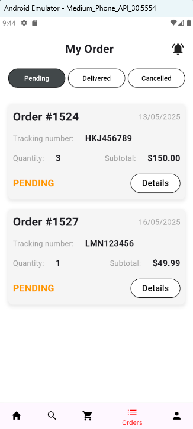
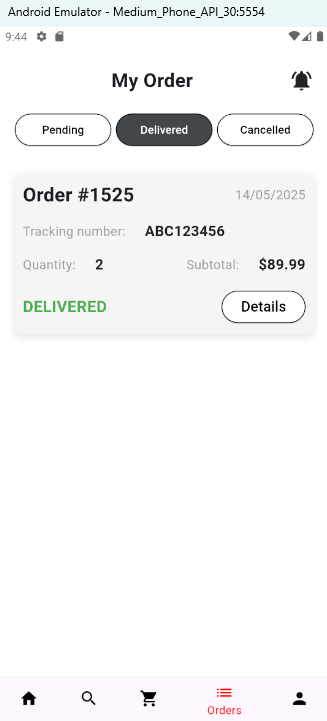
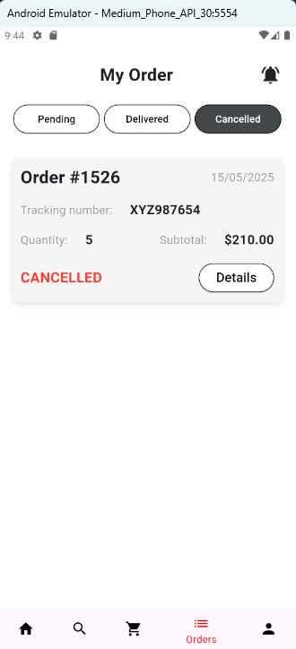
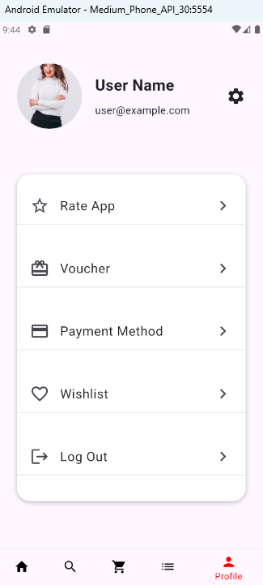
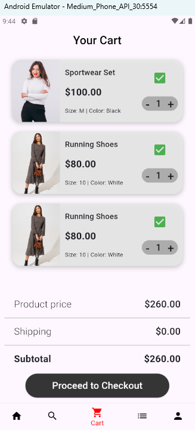

# 💎 FluxShop

**FluxShop** là một ứng dụng di động bán **trang sức dành cho phụ nữ**, được thiết kế với phong cách hiện đại, nhiều mẫu mã tinh tế, và trải nghiệm mua sắm mượt mà.

Ứng dụng được phát triển bằng **Flutter** cho phần frontend (app di động) và **Node.js** cho phần backend (server & database).

---

## 🛍️ Tính năng chính

- 💖 **Trang chủ (Homepage)**: Hiển thị sản phẩm nổi bật và khuyến mãi.
- 🔍 **Khám phá (Discovery)**: Khám phá các danh mục và mẫu mã trang sức phong phú.
- 📦 **Đơn hàng của tôi (My Order)**: Quản lý đơn hàng và theo dõi trạng thái vận chuyển.
- 👤 **Hồ sơ cá nhân (My Profile)**: Quản lý thông tin người dùng, đổi mật khẩu...
- 🛒 **Giỏ hàng (Cart)**: Quản lý các sản phẩm đã chọn trước khi thanh toán.

---

## 🖼️ Giao diện ứng dụng

### 📱 Homepage

---

### 🔍 Discovery

---

### 📦 My Order

---

### 👤 My Profile

---

### 🛒 Cart

---

## 🛠️ Công nghệ sử dụng

| Phần mềm       | Công nghệ         |
| -------------- | ----------------- |
| App frontend   | Flutter           |
| Server backend | Node.js + Express |
| Cơ sở dữ liệu  | MySQL             |

---

## 🌐 Kết nối dữ liệu

FluxShop lấy dữ liệu sản phẩm, thông tin người dùng và đơn hàng thông qua các **RESTful API** từ server Node.js, giúp:

- Tải dữ liệu động từ database
- Quản lý đơn hàng theo thời gian thực
- Cập nhật giỏ hàng, thông tin cá nhân...

---
